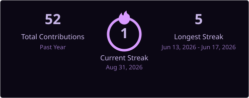

<!-- ========================= -->
<!--           HEADER          -->
<!-- ========================= -->

 

<!-- ========================= -->
<!--          ABOUT ME         -->
<!-- ========================= -->

<h2 align="center">✦ About Me</h2>

  Technical course in Systems Analysis and Development at SENAI-BA,
  currently in my 3rd semester.

  I'm more interested in front-end development and currently deepening
  my studies in web development with HTML, CSS and JavaScript.

  I'm passionate about pixel art, and whenever I can, I try to bring
  technology and that art together in my projects.

<!-- ========================= -->
<!--        TECHNOLOGIES       -->
<!-- ========================= -->

<h2 align="center">✦ Technologies</h2>

<strong>Languages</strong> 

<strong>Web</strong> 

<strong>Tools</strong> 

<strong>Database</strong> 

<strong>Creative</strong> 
Canva · Kdenlive · DaVinci Resolve

<!-- ========================= -->
<!--          PROJECTS         -->
<!-- ========================= -->

<h2 align="center">✦ Projects</h2>

  <strong>PortalEd Lite</strong>  
  A mobile app built with a team to address the career indecision young people
  in tech face when entering the job market. 
   
  I was responsible for the design,
  including presentations and screen layouts, as well as development in Android Studio with Firebase integration.
   
  I learned a lot about accessibility, responsiveness and database integration.
   
   
  <code>Android Studio</code> · <code>Java</code> · <code>Firebase</code>
   
   
  <a href="https://github.com/maryh-dev/PortalEd_Lite_v1">View project →</a>

<!-- ========================= -->
<!--       GITHUB ACTIVITY     -->
<!-- ========================= -->

<h2 align="center">✦ GitHub Activity</h2>

 

 

<!-- ========================= -->
<!--          CONTACT          -->
<!-- ========================= -->

<h2 align="center">✦ Contact</h2>

</a>

<!-- ========================= -->
<!--           FOOTER          -->
<!-- ========================= -->

✦ building things, one pixel at a time ✦

